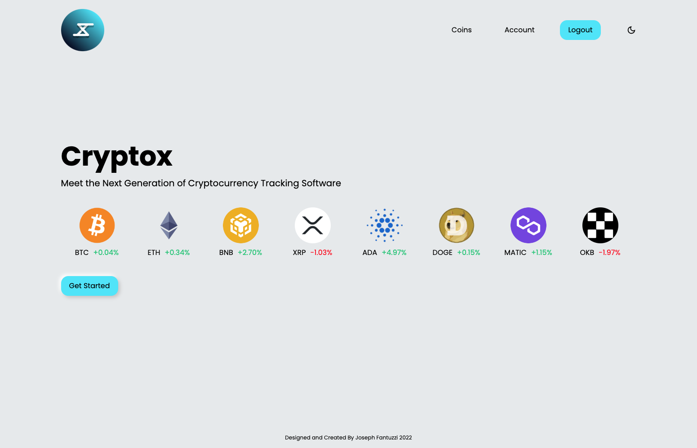
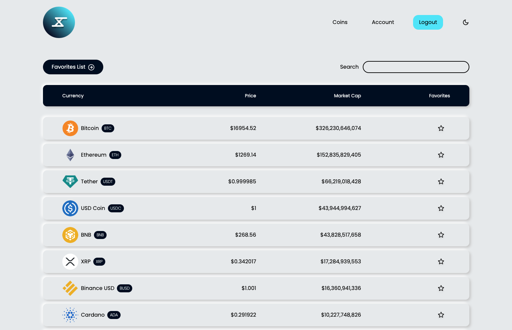

<div align="center">
   
</div>
<h1 align="center">
   Cryptox
</h1>
<p align="center">
   A cryptocurrency tracking software enabling authenticated users to view the top 250 coins, create a favorites list, and view important market data for each coin.
</p>
<p align="center">
   Deployed Site: <a href="https://cryptox-cryptocurrency-tracker.vercel.app/" target="_blank">cryptox-cryptocurrency-tracker.vercel.app</a>
</p>




## Installation and Set Up

### Frontend

1. Install dependencies

```sh
npm install
```

2. Start the development server

```sh
npm run start
```

### Backend

1. Install dependencies

```sh
npm install
```

2. Run Database Migration and Seeding Script

```
npm run resetdb
```

3. Start the nodemon development server

```sh
npm run server
```

## Building and Running for Production

1. Build the application for production usage

```sh
npm run build
```

## Scripts

### Frontend

- `npm run start` starts the development react server
- `npm run build` builds the react frontend for production

### Backend

- `npm run start` starts the node server
- `npm run server` starts the nodemon server
- `npm run migrate` runs the knex migration up functions
- `npm run rollback` runs the knex migration down functions
- `npm run seed` runs the knex seed files
- `npm run resetdb` resets the database back to its original state
