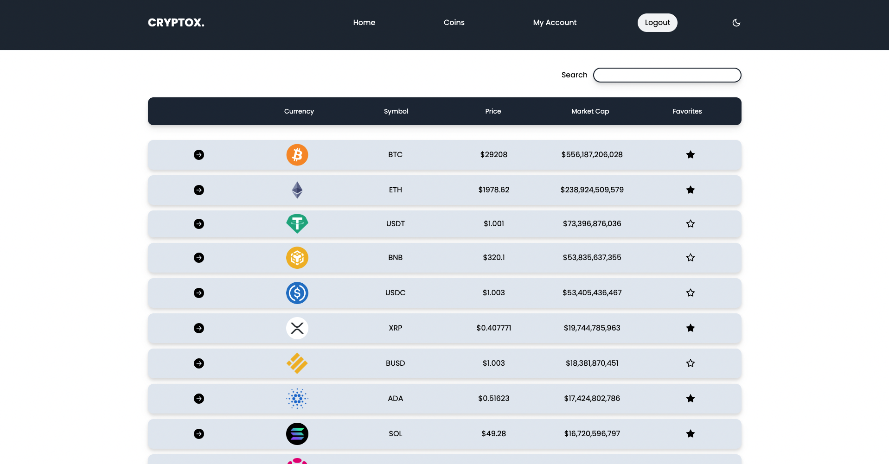

# CRYPTOX Cryptocurrency Tracking Software

## NPM Scripts

- Frontend

  - `npm run start` starts the development react server
  - `npm run build` builds the react frontend for production

- Backend
  - `npm run start` starts the node server
  - `npm run server` starts the nodemon server
  - `npm run migrate` runs the knex migration up functions
  - `npm run rollback` runs the knex migration down functions
  - `npm run seed` runs the knex seed files
  - `npm run resetdb` resets the database back to its original state

